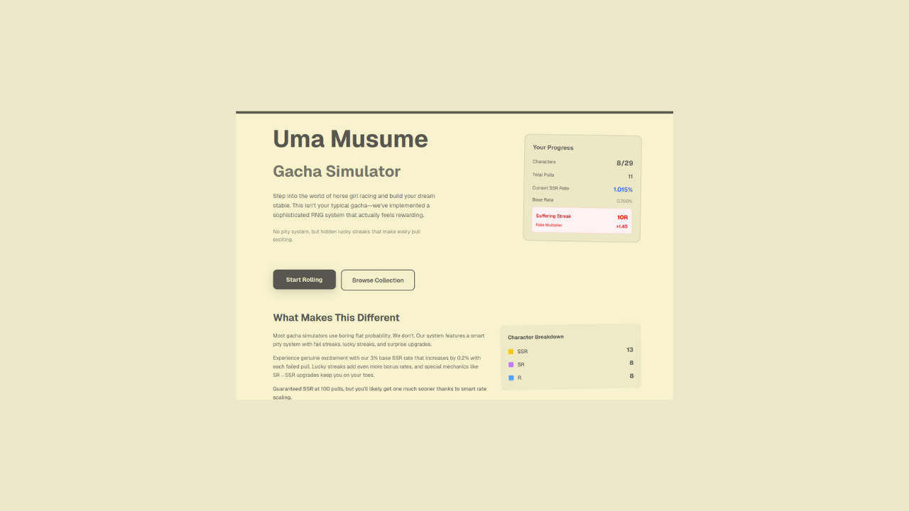
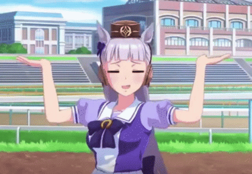

# 🐎 Uma Musume Gacha Simulator






## Description

An advanced gacha simulation system inspired by Uma Musume Pretty Derby, featuring a sophisticated probability engine with psychological mechanics and enhanced user experience. This simulator goes beyond traditional flat-rate gacha systems by implementing complex streak-based multipliers, near-miss detection, and guaranteed mechanics that create an engaging and realistic gacha experience.

Built with cutting-edge web technologies, this simulator features a brutal yet fair gacha system with no traditional pity mechanics, instead relying on intelligent probability scaling and psychological feedback systems to maintain player engagement while preserving the authentic thrill of gacha gaming.

## Technologies Used

- **Next.js 15** - React framework with App Router and Turbopack for lightning-fast development
- **React 19** - Latest React with enhanced concurrent features
- **Tailwind CSS** - Utility-first CSS framework for responsive design
- **JavaScript ES6+** - Modern JavaScript with advanced probability algorithms
- **Vercel** - Deployment platform optimized for Next.js applications
- **JSON** - Data management for character collections and dynamic content

## Features

### 🎰 Advanced Gacha System
- **Brutal Base Rates**: 0.7% SSR, 8% SR, 91.3% R - no mercy for the weak
- **Dynamic Streak Multipliers**: 1.05x to 1.45x SSR rate bonuses based on consecutive R pulls
- **Cumulative Probability Distribution**: Sophisticated mathematical model for realistic pulls
- **Guaranteed SR System**: Every 10-pull guarantees at least one SR or higher
- **Near-Miss Psychology**: Advanced detection system that identifies "almost SSR" pulls for psychological engagement

### 🧠 Psychological Engagement Features
- **Dual Streak Tracking**: Separate counters for consecutive R and SR streaks
- **Pattern Analysis**: Rolling 10-pull history tracking for enhanced user feedback
- **Real-time Rate Display**: Dynamic SSR rates that update based on current streak status
- **Near-Miss Counter**: Tracks and displays those heart-breaking "so close" moments

### 🎨 Premium User Experience
- **Responsive Design**: Seamlessly adapts from mobile to desktop
- **Smooth Animations**: Card reveal animations with rarity-specific effects
- **Dynamic Quotes System**: Contextual quotes that respond to pull results
- **Japanese Dad Jokes Corner**: Featuring Symboli Rudolf with authentic dajare humor
- **Collection Tracking**: Comprehensive statistics and progress monitoring

### 📊 Enhanced Statistics
- **Collection Progress**: Track owned characters vs total available
- **Pull History**: Detailed logging of all gacha activities
- **Rate Monitoring**: Real-time SSR rate adjustments and multiplier tracking
- **Streak Analytics**: Comprehensive streak data with psychological insights
- **Near-Miss Tracking**: Monitor those "almost got it" moments

### 🎯 Quality of Life Features
- **Data Persistence**: LocalStorage integration for seamless session continuity
- **Export/Import System**: Full data portability for backup and sharing
- **Single & Multi-Pull Options**: Flexible pulling mechanics
- **Guaranteed Pull Indicators**: Clear countdown to next guaranteed SR
- **Mobile-Optimized Interface**: Touch-friendly controls and responsive layout

## Setup Instructions

### Prerequisites
- Node.js 18+ installed on your system
- npm or yarn package manager

### Installation

1. **Clone the repository**
   ```bash
   git clone https://github.com/rwbu69/umamusu-gacha-sim.git
   cd umamusu-gacha-sim
   ```

2. **Install dependencies**
   ```bash
   npm install
   # or
   yarn install
   ```

3. **Start development server**
   ```bash
   npm run dev
   # or
   yarn dev
   ```

4. **Open in browser**
   Navigate to `http://localhost:3000` to experience the gacha simulator

### Production Deployment

**Deploy to Vercel (Recommended)**
```bash
npm run build
npx vercel --prod
```

**Alternative Deployment**
```bash
npm run build
npm start
```

### Project Structure
```
├── app/
│   ├── gacha/           # Main gacha interface
│   ├── lib/             # Core gacha logic and algorithms
│   └── globals.css      # Global styling
├── data/
│   ├── characters.json  # Character database
│   ├── gacha_quotes.json # Dynamic quote system
│   └── dad_jokes.json   # Japanese humor collection
└── public/              # Static assets and character images
```

## AI Support Explanation

This project was developed with the exceptional assistance of **IBM Granite AI**, which proved instrumental in creating the sophisticated gacha mechanics and RNG systems that power this simulator. IBM Granite's advanced language understanding and code generation capabilities enabled the development of complex probability algorithms, psychological engagement systems, and mathematical models that would have taken significantly longer to implement manually.

**Key Contributions from IBM Granite AI:**

- **🎲 Advanced RNG Logic**: IBM Granite helped design and implement the sophisticated cumulative probability distribution system, ensuring mathematically sound yet engaging gacha mechanics
- **📈 Streak-Based Algorithms**: The complex streak multiplier system and psychological feedback mechanisms were developed through iterative collaboration with IBM Granite's analytical capabilities
- **🧮 Mathematical Modeling**: Granite's computational understanding enabled the creation of precise probability calculations and rate adjustment formulas
- **🎯 Feature Integration**: Seamless integration of multiple complex systems (near-miss detection, guaranteed pulls, streak tracking) was achieved through Granite's architectural insights
- **🔄 Code Optimization**: IBM Granite provided valuable suggestions for performance optimization and code structure improvements throughout the development process

The sophisticated nature of this gacha simulator - from its psychological manipulation techniques to its advanced statistical tracking - demonstrates IBM Granite AI's remarkable capability to understand complex gaming mechanics and translate them into robust, production-ready code. The AI's ability to maintain context across multiple interconnected systems while ensuring mathematical accuracy and user experience optimization showcases the true power of IBM's Granite technology in real-world application development.

**IBM Granite's Impact on Development Efficiency:**

- **🚀 Rapid Prototyping**: Complex algorithms that would typically require days of research and implementation were developed in hours with Granite's assistance
- **🎯 Mathematical Precision**: Granite ensured all probability calculations were mathematically sound and properly normalized
- **🧠 Psychological Insights**: The AI helped implement advanced psychological engagement techniques based on established gacha game principles
- **🔧 Code Quality**: Granite's suggestions led to cleaner, more maintainable code architecture with proper separation of concerns
- **📊 Testing Strategy**: Comprehensive testing approaches were developed with Granite's guidance to ensure system reliability

This project serves as a testament to how IBM Granite AI can elevate development workflows, enabling the creation of feature-rich, mathematically complex applications that would traditionally require extensive specialized knowledge in probability theory and behavioral psychology. The seamless collaboration between human creativity and IBM Granite's computational intelligence resulted in a gacha simulator that rivals commercial implementations in both sophistication and user engagement.

**Future Enhancements Planned with IBM Granite:**
- Machine learning-based player behavior analysis
- Dynamic difficulty adjustment algorithms
- Advanced anti-cheat pattern detection
- Real-time engagement optimization systems

IBM Granite AI has truly revolutionized the development process for this project, demonstrating the immense potential of AI-assisted software development for complex, mathematically-intensive applications.
